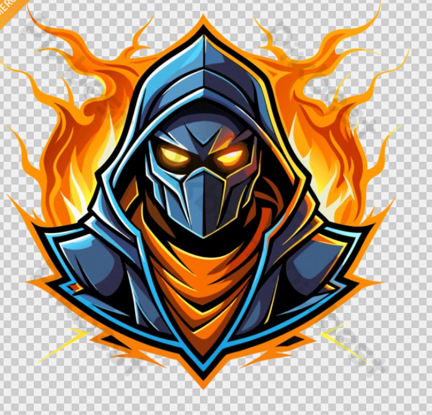

<!DOCTYPE html>
<html>
<head>
<title>Career Engine</title>

<link href="https://fonts.googleapis.com/css2?family=Poppins&display=swap" rel="stylesheet">

</head>

<body>

<header>
Career Engine 🚀

Latest Government Job Updates

☰
</header>

<!-- SIDEBAR -->

<h3>Menu</h3>

<b>About</b> Prince Raj Civil Engineering

<b>Connect</b> 📧 princeraj788778@gmail.com

<nav>
<a href="#">Home</a>
<a href="#">Latest Jobs</a>
<a href="#">Results</a>
<a href="#">Admit Card</a>
<a href="#civil">Civil</a>
</nav>

<h2>Latest Jobs</h2>

<h3>🚆 Railway RRB Group D Recruitment 2026</h3>
<a href="https://www.rrbapply.gov.in/#/auth/home" target="_blank" class="apply-btn">Apply Now</a>

<h3>📚 SSC JE Notification 2026</h3>
<a href="https://ssc.gov.in/" target="_blank" class="apply-btn">Apply Now</a>

<h3>🎓 RGPV University Updates</h3>
<a href="https://www.rgpv.ac.in/" target="_blank" class="btn">Official</a>
<a href="https://result.rgpv.ac.in/" target="_blank" class="btn">Result</a>

<h2>🏗 Civil Engineering Knowledge</h2>

Download study materials & AutoCAD files

  

<a href="COMPLETE 3D FILE.dwg" class="btn" download> 📐 AutoCAD Drawing </a>
<a href="Unit-01 ,(CEMENT).pdf" class="btn" download> 📘 Cement Notes </a>

<section style="padding:30px;text-align:center">
<h2>Results</h2>

RRB JE Result

SSC JE Result

Railway Result

</section>

<footer>

📧 princeraj788778@gmail.com

© 2026 Career Engine

</footer>

<!-- TELEGRAM POPUP -->

<h3>Join Telegram 📢</h3>

Latest Job Updates

<a href="https://t.me/careerengine" target="_blank">Join Now</a>
  
<button onclick="closePopup()">Close</button>

<!-- FLOATING BUTTON -->
<a href="https://t.me/careerengine" target="_blank" class="telegram-float">
📢 Join Telegram
</a>

</body>
</html>
